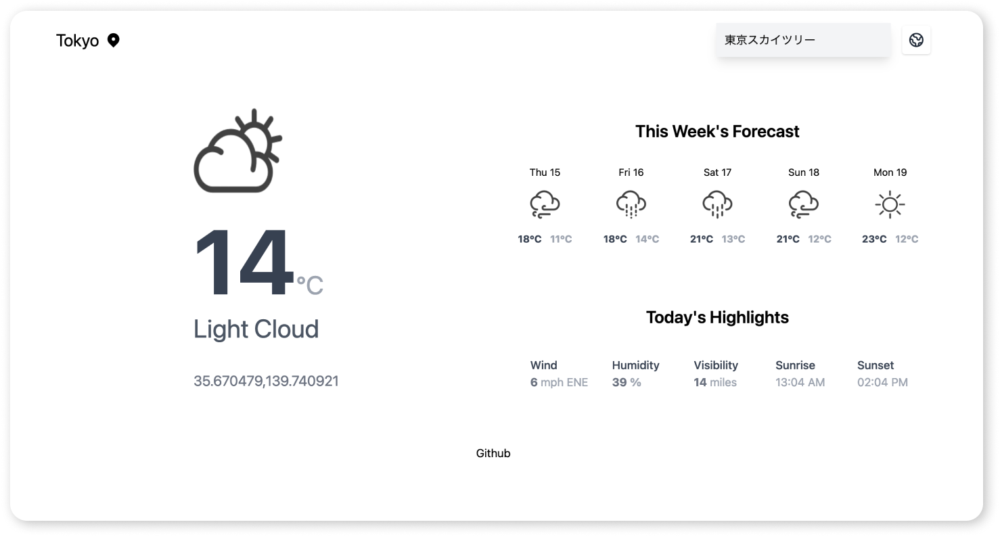

## Table of Contents

- [Notes](#notes)
  - [Date](#date)
  - [Time spent](#time-spent)
  - [Shortcuts](#shortcuts)
  - [Stretch Goals Attempted](#stretch-goals-attempted)
  - [Explain the reasons for the tech stack](#reasoning-for-this-tech-stack)
- [Instructions to run assignment locally](#instructions-to-run-assignment-locally)
- [What did you not include in your solution](#what-did-you-not-include-in-your-solution-that-you-want-us-to-know-about)
- [Other information about your submission](#other-information)
- [Built With](#built-with)
- [Acknowledgements](#acknowledgements)
- [Contact](#contact)
## Notes

Weather as a service is a simple UI that gets the weather for any city via the metaweather API.

This is my personal take-home test as application for Intermediate Full-Stack Engineer at [Thinkific](https://www.thinkific.com/):

### Date
April 15th, 2021.

### Location of deployed application

- Please visit the project at [https://weather-service.vercel.app/](https://weather-service.vercel.app/).
- The API Documentation using Postman is at [https://documenter.getpostman.com/view/11772971/TzJrAyTV](https://documenter.getpostman.com/view/11772971/TzJrAyTV).

### Time spent

Total: 3-4 hours for basic REST api. And approximately another scattered 8-10 hours allocated throughout work week in attempt to accomplish stretch goals.

### Shortcuts

- Nearing the end I had planned to turn TypeScript mode to "strict" but I wanted to focus on some stretch goals.
- I wanted to implement Auth but didn't have enough time.

### Stretch goals attempted
- [x] Proxy a real weather API. (Stretch)
- [x] Have a Simple UI. (Stretch)

  - With end user in mind, I tried to make sure that users always had a query result. 
  - The user could opt-in to allow geolocation. It's not a must.
  - This means always loading a default location. 

### Reasoning for this tech stack
I chose the Next.js because I think it was the framework that I enjoy working with, and well suited to the task to demonstrate my ability to get the data layer to the frontend.

It is added-bonus that Next.js has built-in API routing available in the`/pages/api` directory. 

- I can manage my front and backend code in one place effectively.
- I don't have to worry about Cross origin resource issues.

Possible improvements:
  - Metaweather actually accepts partial strings and returns a response for best location matches too. 
  - Potentially I could have prevented use of Google API and the "google places autocomplete" library and only used Metaweather. 
  - Maybe try to code a better custom input field, maybe with debounce functionality, so it doesnt make too many API calls to metaweather, or tax the user's experience. Ideally, the user could type a partial string and would already start to see possible results, and be able to select these partial city matches as they type and be on their way.

  - But I understood that two API calls need to be made with Metaweather from the User side, since no one can commit latitude/longitude or "where-on-earth-id" to their memory. (Metaweather accepts either two as params in order to return a forecast)

  - When I made the realization that users will probably make two API calls regardless ex. 1)location string 2) location string to Metaweather to return forecast - and I was already committed to Metaweather, I opted for "google places autocomplete" to save time from implementing the search input field as well.

  - I wish I had done a better job with CSS in all media queries but mainly this was nearing the end of my assignment window and mainly poured my attention at desktop and mobile. I opted for tailwind because i knew it was mobile first.

  - I would have liked to abstract my components away from the main file for better maintainability.

  - I would have liked to offer conversion for both metric and imperial unit users. Metaweather offers temperature in celsius and things such as distance in miles.
  
### Instructions to run assignment locally
```bash
# Clone this repository
$ git clone https://github.com/hype08/weather-service

# Change directory
$ cd weather-service/app

# Start
$ npm run dev
```

### What did you not include in your solution that you want us to know about?

- I had considered and wanted to try implementing an Authentication solution, but ran out of time.


### Other information

### Built With
  - [NextJS](https://nextjs.org/)
  - [NextJS Typescript Boilerplate](https://github.com/vercel/next.js/tree/master/examples/with-typescript)
  - [Open MetaWeather API](https://www.metaweather.com)
  - [Google Places Autocomplete](https://developers.google.com/maps/documentation/places/web-service/autocomplete)
  - [Tailwind CSS](https://tailwindcss.com/)
    
## Acknowledgements
- [How to get user location in the browser](https://dev.to/codebucks/how-to-get-user-s-location-in-react-js-1691)
- [Use-Places-Autocomplete Example](https://github.com/wellyshen/use-places-autocomplete)
- [Weather Forecast Icons](https://dribbble.com/shots/14189824-Weather-Icons-Imminent-35-Icon-Free-Download)


## Contact

- GitHub [@hype08](https://github.com/hype08/)